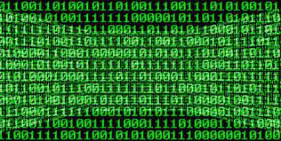

"여러분은 컴퓨터공학은 무엇을 배우는 학문인지에 대해 생각해본적 있나요?"

학부시절 수업 시간에 '컴퓨터공학의 본질'은 무엇인가에 대해 얘기한 적이 있었다. 그 중 어떤 학생의 답이 감명 깊어 내 길을 바꾼 적이 있었는데, 갑자기 생각나서 기록해둔다.
지금와서 생각해보면 아마 많은 컴퓨터공학 교수님들 업계종사자들 사이에서 많이 오르내린 정의였던 것 같다.

> "컴퓨터공학의 핵심은 **'추상화(Abstraction)'**와 **'계층화(Hierachy)'**이다."

전기가 흐르거나 끊어지는 **단순한 전기신호**를 **조합**하여 인터넷을 구축하고 게임이나 응용프로그램을 만들고 스마트폰을 사용할 수 있게 만드는 것은 결국 추상화와 계층화를 통해 구현되는 것이다.

'디지털논리회로' 수업에서 회로상 전기적 신호가 어떻게 AND, OR, XOR, NOT이라는 논리적 신호로 추상화 되고, 이걸 재조합하여 다시 ADD, COMPARE와 같은 단순 연산/명령을 구현할 수 있는지 공부한다.

이후, '컴퓨터구조론'과 '시스템프로그래밍' 수업에서 이러한 단순 연산/명령을 통해 CPU가 어떻게 사용자 명령을 읽어 복잡한 연산/명령을 처리할 수 있는지 공부한다.

그리고, '운영체제' 수업에서 여러 연산/명령을 처리하는 하드웨어와 개발자가 만든 소프트웨어가 어떻게 서로 연동되고 작동하는지 공부하고, '데이터베이스', '자료구조론' 수업에서 어떻게 데이터가 저장되고 관리되는 체계를 가질 수 있는지를 공부한다.

'프로그래밍 언어'나 '컴파일러' 수업에서 프로그래밍 언어가 어떻게 소프트웨어로 만들어지는지를 배우며, 프로그래밍 언어도 결국 소프트웨어를 만드는 프로그램이란 것을 공부한다.

이런 과정을 통해 컴퓨터공학의 모든 이론은 단순한 작업들에서 출발하여, 단순 작업을 조합하여 복잡한 작업을 만들고, 이걸 추상화시켜서 다시 더욱 복잡한 구조를 만드는 데 활용하는 방법으로 계층화시켜나가는 것을 공부하도록 구성되어 있다.

생각보다 심오한 얘기였었다. 내 전공을 공부하면서 한 번도 생각해보지 못 했던 질문과 답변이었다. 사실 저 문답을 들으면서 이 길은 내 길이 아니었나.. 싶은 생각을 한 적이 있다.
