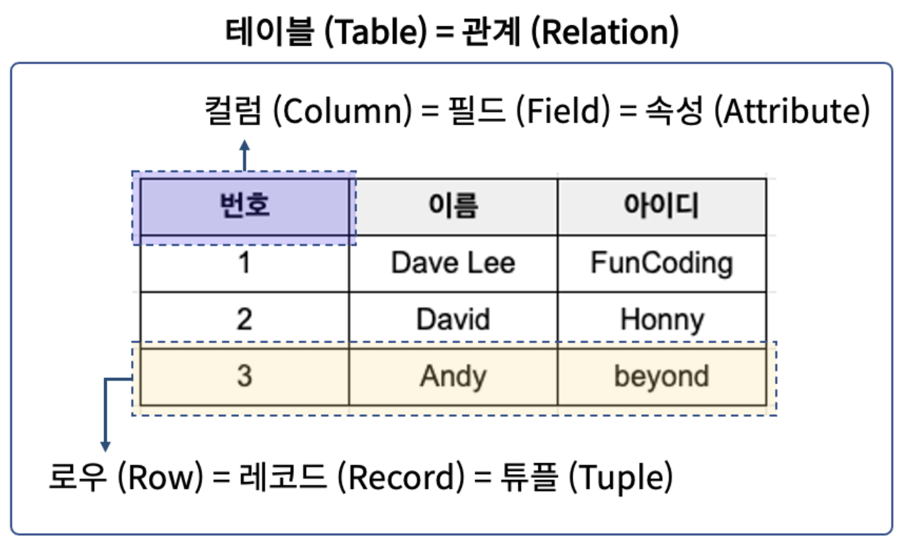

---

layout: single

title: "[데이터베이스 기본] 1. 데이터베이스 기본 개념"

excerpt: "데이터베이스의 개념, 특징, 장단점, DBMS 등"

categories:

- Database

tags:

- Database
- DB Basic

---

## 1.1 데이터베이스 개념
- 체계화된 데이터의 모임
- 여러 응용시스템들의 통합된 정보를 저장하여 운영할 수 있는 공용 데이터의 묶음
- 논리적으로 연관된 하나 이상의 자료 모음으로 데이터를 고도로 구조화함으로써 검색/갱신 등의 데이터 관리를 효율화
- 특정 조직의 여러 사용자들이 공유하여 사용할 수 있도록 통합해서 저장한 운영데이터의 집합

## 1.2 데이터베이스 특징
- 실시간 접근(real-time accessibillity): 사용자가 요구하면 원하는 데이터를 빠른 시간(수초이내) 내에 제공
- 계속 변화(continuous evolution): 현실 세계의 상태를 정확히 반영(동적인 특징이 존재 - 삽입, 삭제, 수정하여 정확한 데이터 유지)
- 동시 공유(concurrent sharing): 여러 사용자가 서로 다른 데이터를 동시 사용 및 같은 데이터를 동시 사용하는 것을 지원
- 내용 기반 참조(content reference): 주소나 위치가 아닌 값으로 참조 가능 ex) 데이터 검색

## 1.3 데이터베이스 장단점
#### 장점
- 데이터 중복 최소화
- 데이터 공유
- 일광성/무결성/보안성 유지
- 최신의 데이터 유지
- 데이터의 표준화 가능
- 데이터의 논리적/물리적 독립성
- 용이한 데이터 접근
- 데이터 저장 공간 절약

#### 단점
- 데이터베이스 전문가 필요
- 많은 비용 부담
- 시스템이 복잡함

## 1.4 데이터베이스 관리 시스템(DBMS)
#### 1.4.1 DBMS란
- 파일 시스템의 데이터 중복과 데이터 종속 문제를 해결하기 위해 제시된 소프트웨어임
- 여러 응용 프로그램들이 동시에 데이터베이스에 접근할 때 발생할 수 있는 문제를 중재함
- 데이터베이스의 생성, 접근, 관리 모두 담당할 수 있고, 사용자는 오직 요청만 하면 되며, 데이터베이스의 물리적 저장 구조나 데이터 접근 및 처리 방법 등을 굳이 자세히 알 필요가 없음
- 데이터 변동 발생 시 사용자가 알거나 응용 프로그램이 변경될 필요가 없음
#### 1.4.2 DBMS 주요 기능
- 정의 기능: 데이터베이스 구조를 정의하거나 수정 가능

- 조작 기능: 데이터를 삽입,삭제,수정,검색하는 연산 가능

- 제어 기능: 데이터를 항상 정확하고 안전하게 유지 가능
  장애가 발생하더라도 회복이 가능하도록 제어, 보안유지, 동시공유를 보장할 수 있음

  

## 1.5 RDBMS(Relational Database Management System, 관계형 데이터베이스 관리 시스템)
- 데이터베이스의 한 종류로서 가장 많이 사용됨

- 역사가 오래되어 신뢰성 높고 데이터 분류/정렬/탐색 속도가 빠름

- 관계형 데이터베이스 = 테이블

- 2차원 테이블(Table) 형식을 이용하여 데이터를 정의하고 설명하는 데이터 모델

- 관계형 데이터베이스에서는 데이터를 속성(Attribute)과 데이터값(Attribute Value)으로 구조화(2차원 테이블)

- 데이터를 구조화한다는 것은 속성(Attribute)과 데이터값(Attribute Value) 사이에서 관계(Relation)를 찾아내고, 이를 테이블 모양의 구조로 도식화함의 의미함

  

  

## 1.6 NoSQL/NewSQL DBMS
- NoSQL DBMS: RDBMS의 안정성, 일관성을 포기, 데이터 구조를 정해두지 않기에 비정형 데이터를 저장하고 처리하는 데 적합하며, 뛰어난 확장성을 지님. 여러 대의 서버 컴퓨터에 데이터를 분산 저장 및 처리하는 환경에서 주로 사용함 (ex. MongoDB, Cassandra, Redis, Neo4j, OriedntDB)
- NewSQL DBMS: 정형 데이터는 관계 DBMS로 처리하고 비정형 데이터는 NoSQL로 처리하고자 각자 도입하기엔 부담과 불편함이 존재하여 NewSQL의 필요성이 대두되면서 등장함. 안정성과 일관성을 유지하면서 확장성과 유연성을 지원하여 정형 및 비정형 데이터를 안정적이고 빠르게 처리 가능 (ex. Spanner, VoltDB, NuoDB)
