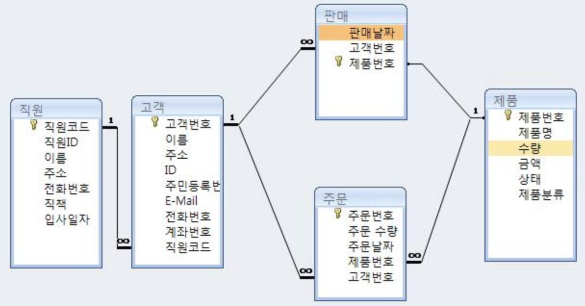

---

layout: single

title: "[데이터베이스 기본] 2. 데이터베이스 스키마, 구조, 사용자"

excerpt: "데이터베이스의 스키마와 구조, 사용자"

categories:

- Database

tags:

- Database
- DB Basic

---

## 2.1 스키마(schema)

- 데이터베이스의 테이블 구조 및 형식, 관계 등 정보를 형식 언어(formal language)로 기술함
- 관계형 데이터베이스를 사용하여 데이터를 저장할 때 가장 먼저 할 일은 데이터의 공통 속성을 식별하여 컬럼으로 정의하고, 테이블을 만드는 것
- 통상적으로 하나의 테이블이 아닌 여러 개의 테이블로 만들고, 각 테이블 구조, 형식, 관계를 정의함
- 이를 스키마라고 하며, 일종의 데이터베이스 설계도로 이해하면 됨
- 데이터베이스마다 스미카를 만드는 언어가 존재하며, 해당 스키마만 있으면 동일한 구조의 데이터베이스를 만들 수 있음 (데이터베이스 백업과는 달리 데이터 구조로만 동일하게 만들 수 있음)

- 스키마: 데이터베이스에 저장되는 데이터 구조와 제약조건을 정의
- 인스턴스: 정의된 스키마에 따라 데이터베이스에 실제로 저장된 값
스키마는 한번 정의되면 자주 변경되지 않으나, 인스턴스는 계속 변하는 특성 존재

## 2.2 구조
개별 사용자 관점 - 외부 단계(external level)
조직 전체의 관점 - 개념 단계(conceptual level)
물리적인 저장 장치의 관점 - 내부 단계(internal level)

#### 2.2.1 외부 단계
- 개별 사용자가 데이터베이스를 어떻게 보는가를 표현 (사용자마다 생각하는 데이터베이스의 구조가 다름)
- 외부 단계에서 사용자에게 필요한 데이터베이스를 정의한 것 - 외부 스키마(서브 스키마) -
- 데이터베이스 하나에 외부 스키마가 여러 개가 존재할 수 있고, 외부 스키마 하나를 목적이 같은 사용자들이 공유 가능

#### 2.2.2 개념 단계
- 사용자들의 관점을 통합하여, 데이터베이스를 조직 전체의 관점에서 이해하고 표현
- 개념 단계에서 모든 사용자에게 필요한 데이터를 통합하여 전체 데이터베이스의 논리적 구조를 정의한 것 - 개념 스키마 -
- 개념 스키마: 조직 전체의 관점에서 생각하는 데이터베이스의 모습이며, 어떤 데이터가 저장되는지, 데이터들 간의 관계, 제약조건, 데이터에 대한 보안 정책, 접근 권한에 대한 내용들 포함하지만 데이터를 물리적으로 저장하는 방법이나 데이터 저장 장치와는 독립적임
- 데이터베이스 하나에 개념 스키마는 하나만 존재
- 일반적으로 스키마라고 언급하면 개념 스키마를 의미한다.

#### 2.2.3 내부 단계
- 데이터베이스를 저장 장치의 관점에서 이해하고 표현
- 내부 단계에서 전체 데이터베이스가 저장 장치에 실제로 저장되는 방법을 정의한 것 - 내부 스키마 -
- 내부 스키마: 데이터베이스의 개념 스키마에 대한 물리적인 저장 구조를 표현한 것이며 하나만 존재

## 2.3 데이터 독립성
- 하나의 데이터베이스에는 3가지 유형의 스키마가 존재하지만, 각 스키마는 데이터베이스를 바라보는 관점이 다름. 그래도 결국 모두 같은 데이터베이스를 표현함
- 스키마 사이의 대응 관계 - 사상, 매핑(mapping) -
- DBMS는 미리 정의된 매핑 정보를 이용하여 사용자가 원하는 데이터에 접근할 수 있음

## 2.4 데이터 사전
- 데이터베이스에 저장되는 데이터에 관한 정보를 저장하는 장소 (동의어: 시스템 카탈로그, 메타 데이터)
- 스키마와 사상 정보(매핑) 그리고 제약조건을 저장
- 일반 사용자도 접근할 수 있으나 저장 내용에 대한 검색만 가능

## 2.5 데이터베이스 사용자
- DB 사용자에는 데이터베이스 관리자(DBA), 최종 사용자, 응용 프로그래머가 존재함

#### 2.5.1 데이터베이스 관리자(DBA)
데이터베이스 시스템을 운영 및 관리하며, 조직 내의 사용자를 위해 데이터베이스를 설게 및 구축, 제대로 서비스할 수 있도록 데이터베이스를 제어, 데이터 정의어와 데이터 제어어를 이용해 데이터베이스에 접근하고, 데이터베이스 운영,관리를 책임지기 때문에 컴퓨터 시스템이나 데이터베이스 관련 많은 지식과 경험 필요함

- 데이터베이스 구성 요소 선정: 사용자의 요구 사항을 분석하여 데이터를 결정함
- 데이터베이스 스키마 정의: 구성 요소를 토대로 데이터베이스 스키마를 설계, 데이터 정의어를 이용해 설계한 스키마를 DBMS에 설명함
- 물리적 저장 구조와 접근 방법 결정: 레코드 구조를 설계, 레코드 간의 저장 순서와 빠른 접근을 위한 인덱스를 만들 기준 필드를 결정함
- 무결성 유지를 위한 제약조건 정의: 결함 없는 데이터만 저장할 수 있도록 규칙을 정의, 규칙에 따라 데이터베이스를 제어하여 데이터의 정확성, 유효성을 유지함
- 보안 및 접근 권한 정책 결정: 비인가 사용자의 접근 방지, 인가된 사용자에게 적절한 권한을 부여하는 보안 정책 결정함
- 백업 및 회복 기법 정의: 장애에 대비하여 데이터베이스를 백업, 손상된 데이터베이스를 일관된 상태로 복구하는 방법을 정의함
- 시스템 데이터베이스 관리: 데이터 사전 등을 관리함
- 시스템 성능 감시 및 성능 분석: 병목 현상 등이 발생하지 않는지 확인, 시스템 자원의 활용도 분석 등을 통해 시스템의 성능을 감시함
- 데이터베이스 재구성: 사용자의 요구 사항이나 사용 형태에 맞게, 시스템의 전체 성능 향상 필요성, 시스템 장비가 교체된 경우 데이터베이스를 재구성함
- 데이터베이스 관리자는 항상 사용자의 요구 사항에 귀 기울이고 시스템 성능을 분석하여, 새로운 변화에 부응하면서 성능을 향상시키는 방향으로 데이터베이스를 재구성하는 것이 필요함

#### 2.5.2 최종 사용자
데이터를 조작하기 위해 데이터베이스에 접근하는 사람들, 주로 데이터 조작어를 사용

- 캐주얼 사용자: 데이터베이스에 대한 이론적 지식, 주로 데이터 조작어를 이용해 원하는 데이터와 데이터 처리를 DBMS에 직접 설명
- 초보 사용자: 메뉴나 GUI 형태의 응용 프로그램을 통해 데이터베이스를 사용

#### 2.5.3 응용 프로그래머
프로그래밍 언어로 응용 프로그램을 작성할 때 데이터베이스에 접근하는 데이터 조작어를 삽입하는 사용자
최종 사용자는 응용 프로그래머가 작성한 응용 프로그램을 사용하여 데이터베이스에 접근 (ex. 도서 위치 검색)