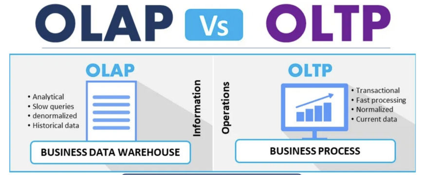

---

layout: single

title: "[데이터베이스 기본] 3. OLTP vs OLAP"

excerpt: "OLAP와 OLTP간의 차이점"

categories:

- Database

tags:

- Database
- DB Basic

---

## 1. OLTP (Online Transaction Processing)
직역하면 '온라인 트랜잭션 처리'로서 여러 사용자 PC에서 발생되는 트랜잭션(Tranaction)을 DB서버가 처리하고, 그 결과를 요청한 사용자 PC에 결과값을 되돌려 주는 과정을 말한다. 즉, 1개의 요청 작업을 처리하는 과정을 OLTP라고 보면 이해하기 편하다.

 예를 들어, 은행에 예금(입금)하는 것을 ① 돈과 카드를 은행원에게 전달 → ② 은행원이 돈과 카드를 확인한 후 입금 실행 → ③ 입금 내역을 확인까지 3단계의 프로세스로 가정할 때, 모든 3단계가 완벽히 끝나야 되는 것으로 볼 수 있다. **3단계를 통째로 '1개'의 요청작업(=트랜잭션)**으로 보는 것이다.

 다시 말해, 중간에 예기치 못한 사고로 인해 2단계 작업까지만 수행되고 멈춘다면, 지금까지 진행된 1, 2단계 모든 작업 내용을 **'무효화(=롤백, Rollback)'**시켜줘야 한다. 반면, 3단계 모든 작업이 정상적으로 완료될 경우, 작업을 **'확정(=커밋, Commit)'**시켜줘야 한다.

 정리하면, OLTP는 무수히 많이 발생되는 각 작업요청을 오류 없이 처리하고 그 결과값을 실시간으로 확인시켜주는 것으로서, 1개의 트랜잭션에서 발생되는 INSERT, UPDATE, DELETE의 과정에서 **'무결성'**을 보장하여 처리하고 그 결과를 SELECT하는 과정을 일컫는다.

## 2. OLAP (Online Analytical Processing)
 직역하면, '온라인 분석 처리'로서 OLTP는 데이터 자체의 처리를 중점으로 하는 용어인 반면, OLAP은 이미 저장된 데이터에 기반하여 분석하는 데 중점을 둔 용어이다.
 OLAP는 데이터웨어하우스(DW) 또는 DB에 **저장되어 있는 데이터를 분석**하고, 데이터 분석을 통해 **사용자에게 유의미한 정보를 제공**해주는 처리방법을 통칭한다. 더불어, 이런 유의미한 정보에 기반하여 보다 복잡한 모델링을 가능하게 해준다.
 예를 들어, 우리 회사의 1년 매출과 이익 등을 확인하기 위해 총 매출이나 이익 등을 표로 정리하여 보고 싶다고 가정할 때, 해당 자료를 얻기 위해 DB속에 있는 지난 통장거래내역에서 지출/수입을 별도로 계산하고, 기간을 정하여 1년간 벌어들인 수입과 나간 지출을 정리할 수 있다. 이러한 경우처럼 사람이 장부를 살펴보며 하나씩 계산기를 입력하는 것이 아닌 이미 있는 DB에서 원하는 정보를 추출하여 가공하고 분석하기 위한 일련의 과정이 OLAP이다.
 요약하면, OLAP는 이미 저장되어 있는 데이터에서 사용자의 목적에 맞게 추출/분석하여 정보를 제공하는 것을 일컫는다.

## 3. OLTP vs OLAP 차이점
 **OLTP는 현재 데이터 처리가 얼마나 정확하고 무결한지가 중요**하기 때문에 데이터의 저장, 삭제, 수덩 등 실질적인 데이터를 수정 및 처리하는 작업을 의미한다.
 반면, **OLAP는 이미 저장된 데이터에서 어떤 정보를 제공하는지가 중요**하기 때문에 데이터가 정확하고 무결하다는 전제하에 고객 또는 사용자가 원하는 정보를 추출하여 어떻게 표현하고 시사점을 제공하는지를 의미한다.
 즉, 둘 중 선행되어야 할 부분은 OLTP이다. 수집되어 저장되는 데이터가 정확하고 무결하게 DB에 적재되어 있어야 의미있는 분석이 가능하기 때문이다.
 OLTP는 엔지니어에 가까운 용어이고, OLAP은 분석가에 가까운 용어로 이해하면 좀 더 쉽게 이해할 수 있을 것이다.